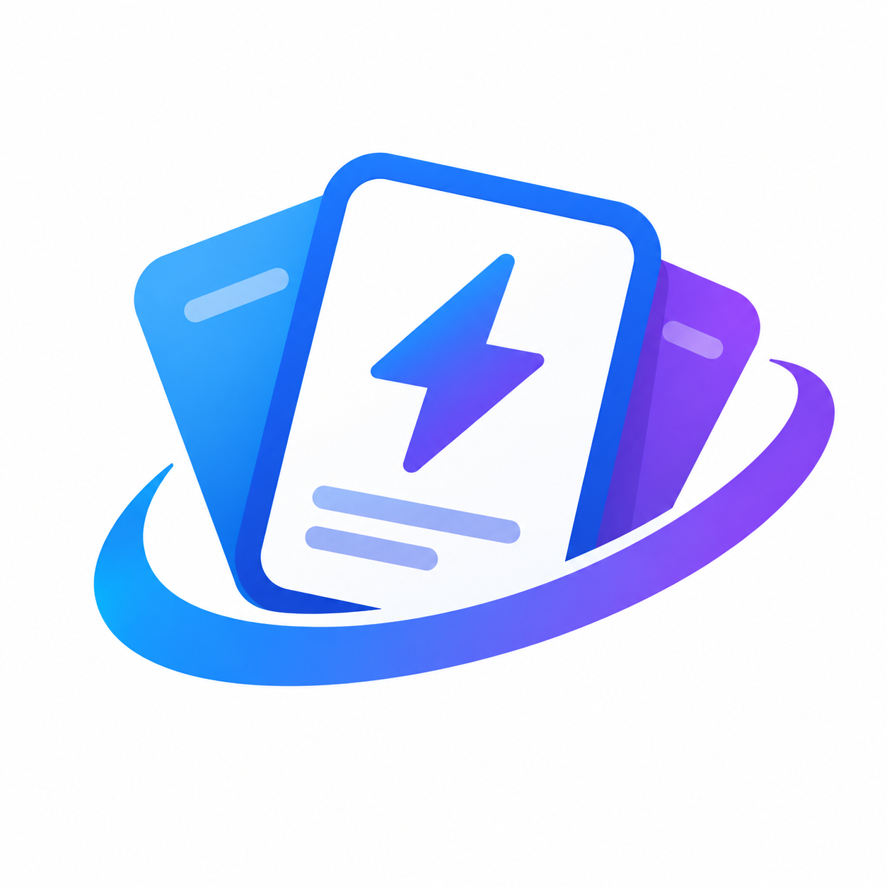

<p align="center">
  
</p>

<h1 align="center">FlashcardAnything</h1>

<p align="center"><strong>Turn anything into flashcards.</strong></p>

<p align="center">
  Paste your words, notes, or definitions, study in seconds.<br>
  No sign-up. No internet needed. Everything runs in your browser.
</p>

## How to use

1. Open `index.html` in a browser (Chrome, Firefox, Safari, Edge, anything works).
2. Paste your text and click **Generate Flashcards**.
3. Study! Click a card to flip it, then rate yourself with **I knew it** / **I missed it**.

That is all there is to it.

## Example formats

One card per line, split front and back with `-`, `:`, `|`, or tab:

```text
Hola - Hello
Gato - Cat
Perro - Dog
```

Or alternating lines (front, back, front, back, ...):

```text
Hola
Hello
Gato
Cat
```

The app detects the format automatically, no setup needed.

## Features

- Instant flashcards from text, with a preview
- Study mode: flip cards, shuffle, score recap, retry missed cards
- Save your favorite decks and open them anytime
- Import / export decks (JSON), a sample file is included on the My Decks page
- Dark mode 🌙

## Privacy

Your data stays in your own browser, it is never sent anywhere.
Clearing browser data deletes your decks too, so export a backup once in a while.

---